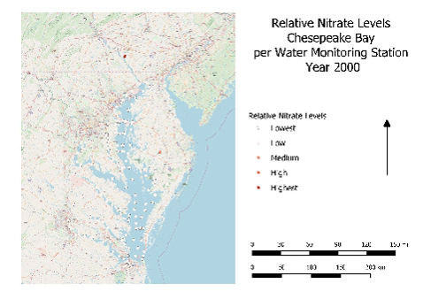
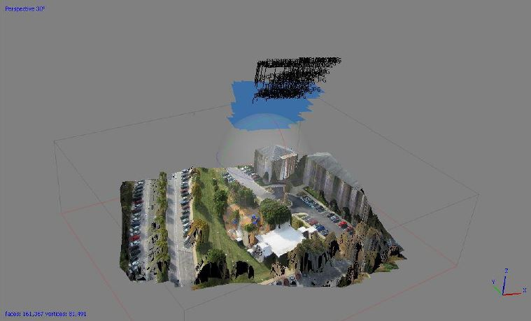
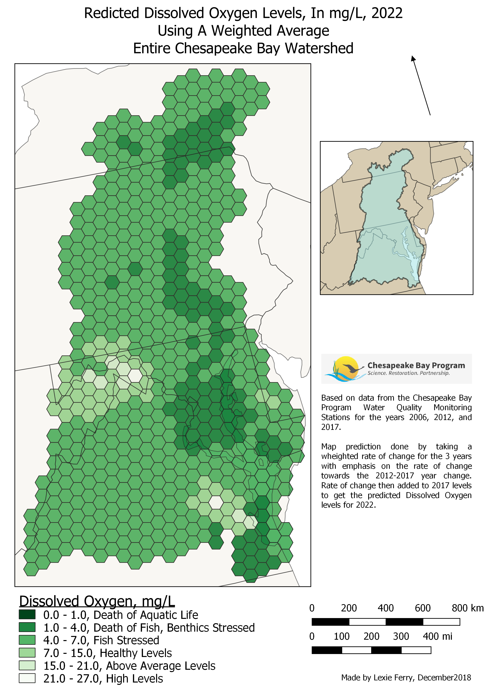

### Lexie Ferry's github Portfolio

<!--This is the first row of projects -->

---

### NDVI and State Tax Rates 

[See more details here.](https://github.com/lexiejferry/lexiejferry.github.io/blob/master/NDVI_Tax_Rates/NDVI_Tax_Rates.md)

**Description** A 3D map of state tax rates and NDVI values of all of Balitmore County in 2017. 

**Software Used:** QGIS 3.2, Mircrosoft Excel (for the graphing and Correlation Equation)

**Tools, Plugins, and Packages:** Spatialite Databases, SQL Query, Zonal Statistics, Clip, Extract/clip by extent, Raster Calculator, Join attributes by location, 2.5D Visualization

---
### Chesapeake Bay Nitrates

[See more details here.](https://github.com/lexiejferry/lexiejferry.github.io/blob/master/Chesapeake_Nitrates_Map/Chesapeake_Nitrates_Map.md)

**Description:** A map of Chesapeake Bay Nitrate levels at all water quality monitoring stations from 2000 to 2017 and a script to sort through any environmental measurement automatically.

**Software Used:** QGIS 3.2, #https://giphy.com

<!--This is the second row of projects -->

  
---

### 3D Agisoft Map 

**3-Dimensional Agisoft Map**

[See more details here.](https://github.com/lexiejferry/lexiejferry.github.io/blob/master/3D_Map_AGISOFT/3D_Map_AGISOFT.md)

**Description:** A 3D Map of a section of Universtiy of Maryland Baltimore County created using Agisoft software.

**Software Used:** Agisoft PhotoScan Professional

---

### Predictive Analysis of Dissolved Oxygen Levels in the Chesapeake Bay in 2022

[See more details here.](https://lexiejferry.github.io/DOmap/DOmap.md)

**Description:** A predictive map of Dissolved Oxygen Levels of the Chesapeake Bay using past DO data and a weighted rate of change.

**Software Used:** QGIS 3.3, GeoDa, ArcMap

**Tools, Plugins, and Packages Used:** Spatialite Databases, SQL Query, Zonal Statistics, IDW Interpolation, Hexagonal Grids, 2.5D Visualization

---

